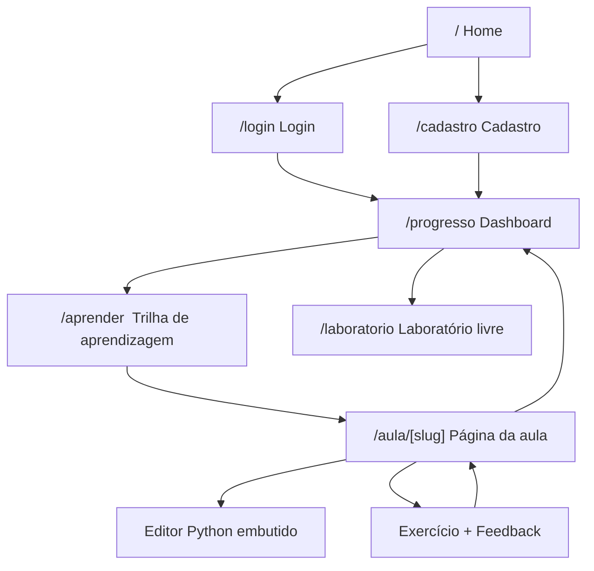

# Arquitetura

## Stack

| Camada | Tecnologia |
| --- | --- |
| Frontend | Next.js 16 (App Router), TypeScript, Tailwind CSS |
| Backend | Next.js Route Handlers (mesma base do frontend) |
| Banco de dados | Supabase PostgreSQL |
| Autenticação | Supabase Auth |
| Hospedagem | Vercel |
| Versionamento | GitHub |

## Camadas internas

1. **Apresentação** (`src/app/`) — páginas e layouts, sem lógica de negócio.
2. **Componentes** (`src/components/`) — blocos de UI reutilizáveis, sem
   acesso direto a dados.
3. **Serviços** (`src/lib/learning`, `src/lib/exercises`) — regras de
   negócio (progresso, adaptação, correção), independentes do framework.
4. **Acesso a dados** (`src/lib/supabase`) — único ponto de contato com o
   banco, com Row Level Security garantindo isolamento por aluno.

## Decisão: execução de código do aluno

O código Python escrito pelo aluno roda com **Pyodide** (Python compilado
para WebAssembly), executado inteiramente no navegador.

- **Motivo**: a plataforma nunca pode permitir que código do usuário acesse
  servidor, banco de dados ou variáveis de ambiente. Rodando no navegador,
  essa garantia é estrutural — não depende de sandboxing no servidor, não há
  superfície de ataque no backend, e não há custo de infraestrutura de
  execução.
- **Trade-off aceito**: sem acesso a bibliotecas nativas (C) fora do que o
  Pyodide empacota; carga inicial de alguns megabytes na primeira execução
  do Laboratório (mitigada com carregamento sob demanda e cache do
  navegador).
- **Alternativa descartada para o MVP**: sandbox server-side (containers
  efêmeros, Judge0). Mais robusta a longo prazo, mas adiciona custo de
  infraestrutura, complexidade de isolamento e latência — desnecessária para
  os exercícios dos módulos iniciais.

## Componentes

| Grupo | Responsável por |
| --- | --- |
| `components/ui/` | primitivos genéricos (Button, Card, Modal, Tooltip, Accordion, Tabs, ProgressBar), sem lógica de negócio |
| `components/lesson/` | estrutura fixa da aula (objetivo, conceito, exemplo, desafio) |
| `components/code-editor/` | wrapper do Pyodide + editor de código |
| `components/exercise/` | consome `AdaptiveLearningService` e o sistema de dicas |
| `components/progress/` | lê de `student_progress` e `concept_mastery` |
| `components/dashboard/` | tela "Meu progresso" |

## Serviços (`src/lib/`)

- `lib/learning/AdaptiveLearningService.ts` — recebe histórico de
  tentativas, retorna recomendação (`{action, concept, difficulty, reason}`).
  Puro, sem dependência de UI ou de rota.
- `lib/exercises/` — avalia a tentativa do aluno contra `expected_behavior`,
  gera o feedback pedagógico.
- `lib/python/` — orquestra o Pyodide (carregamento, timeout, tradução de
  erros). O worker isolado em si (`public/workers/pyodide-worker.js`)
  precisou ficar em `public/` — ver a nota no `DEVELOPMENT.md` sobre a
  limitação do Turbopack para compilar workers referenciados a partir de
  `src/`.
- `lib/supabase/` — clientes Supabase separados por contexto (browser vs.
  server component), nunca misturados.

**Regra de fronteira:** componentes React não chamam Supabase diretamente
nem contêm regras de dificuldade/adaptação — sempre através dos serviços de
`lib/`. Isso mantém o `AdaptiveLearningService` como módulo único e
configurável.

## Mapa de navegação (MVP)



- `/`, `/login`, `/cadastro` — públicas.
- `/progresso`, `/aprender`, `/aula/[slug]`, `/laboratorio` — exigem sessão
  válida (a partir da Fase 4).
- `/aula/[slug]` só renderiza conteúdo se os pré-requisitos do aluno (módulo
  anterior concluído) estiverem satisfeitos.

## Estrutura de pastas

```
src/
├── app/
│   ├── page.tsx                  # Home
│   ├── login/
│   ├── cadastro/
│   ├── aprender/                 # Trilha de aprendizagem
│   ├── aula/[slug]/              # Página de aula
│   ├── laboratorio/              # Laboratório livre
│   ├── progresso/                # Dashboard
│   └── api/                      # Route handlers
│
├── components/
│   ├── ui/
│   ├── lesson/
│   ├── code-editor/
│   ├── exercise/
│   ├── progress/
│   └── dashboard/
│
├── lib/
│   ├── supabase/
│   ├── learning/
│   ├── exercises/
│   └── python/
│
├── types/
└── data/
```

## Área administrativa (futura)

Não implementada no MVP, mas a arquitetura permite:

```
ADMIN
├── Módulos
├── Aulas
├── Conceitos
├── Exercícios
├── Dicas
├── Projetos
├── Alunos
└── Relatórios
```

Vai operar sobre as mesmas tabelas do banco, usando a
`SUPABASE_SERVICE_ROLE_KEY` no servidor (nunca exposta ao cliente).
