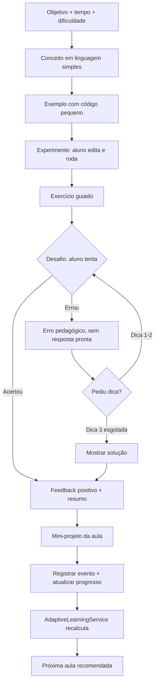

# Método pedagógico

Princípio central: **ENTENDER → VER → FAZER → ERRAR → CORRIGIR → REFAZER →
APLICAR**.

Metodologia de cada conceito novo: **CONCEITO → EXEMPLO → EXPERIMENTAÇÃO →
DESAFIO → FEEDBACK → PROJETO**.

## Estrutura de uma aula

1. Objetivo da aula
2. Conceito (linguagem simples, sem jargão sem explicação)
3. Explicação
4. Exemplo (código pequeno, explicado linha por linha)
5. Código executável
6. Experimentação (aluno altera e executa)
7. Exercício guiado
8. Dicas (até 3 níveis)
9. Desafio
10. Feedback
11. Correção
12. Mini-projeto
13. Resumo
14. Verificação de aprendizagem
15. Próxima aula

## Fluxo de uma aula (implementação)

Exemplo concreto (Módulo 2 — Variáveis):

1. *Conceito:* "Uma variável é um nome que usamos para guardar uma
   informação."
2. *Exemplo:* `nome = "Maria"` / `print(nome)`.
3. *Experimente:* o aluno troca `"Maria"` pelo próprio nome e executa.
4. *Desafio:* "Crie uma variável chamada `cidade` e mostre o conteúdo na
   tela."
5. *Erro típico:* aluno escreve `cidade = Brasilia` (sem aspas) → o sistema
   traduz o `NameError` do Python em explicação pedagógica ("O Python acha
   que Brasilia é outra variável. Textos precisam de aspas."), nunca apenas
   o erro técnico cru.
6. *Mini-projeto:* "Ficha pessoal" — nome, idade e cidade em três `print()`.

## Regra fundamental de pré-requisitos

Nunca presumir que o aluno sabe algo que ainda não foi ensinado. Se uma
atividade usa `for`, o aluno já recebeu uma aula sobre `for`. Se usa
`int(input())`, o sistema já explicou `input()`, números e conversão de
tipos. Cada exercício respeita os pré-requisitos do módulo em que está.

## Sistema de dicas

Até 3 níveis por desafio:

1. Orientação conceitual.
2. Orientação mais específica.
3. Orientação quase resolutiva.

Só depois das três é que "Mostrar solução" fica disponível. O uso de cada
dica é registrado e alimenta o `AdaptiveLearningService`.

## Sistema de dificuldade

| Nível | Descrição |
| --- | --- |
| 1 | Muito fácil |
| 2 | Fácil |
| 3 | Intermediário |
| 4 | Desafiador |
| 5 | Projeto |

A dificuldade nunca aumenta apenas porque uma aula foi concluída. Ver regra
de adaptação em `ARCHITECTURE.md` e no `AdaptiveLearningService`
(`src/lib/learning/`).

## Trilha de módulos

1. Pensamento computacional
2. Primeiro contato com Python (MVP cobre 1 e 2)
3. Variáveis
4. Entrada e saída
5. Operadores
6. Condições
7. Repetições
8. Listas
9. Dicionários
10. Funções
11. Arquivos
12. Projeto final

## Critério de qualidade

O produto só é considerado funcional quando um usuário que nunca programou
consegue: criar conta → entrar → iniciar uma aula → entender o conceito →
executar código → modificar o código → resolver um exercício → receber
feedback → avançar → visualizar seu progresso. Compilar, abrir no navegador
e ter telas não é suficiente.
